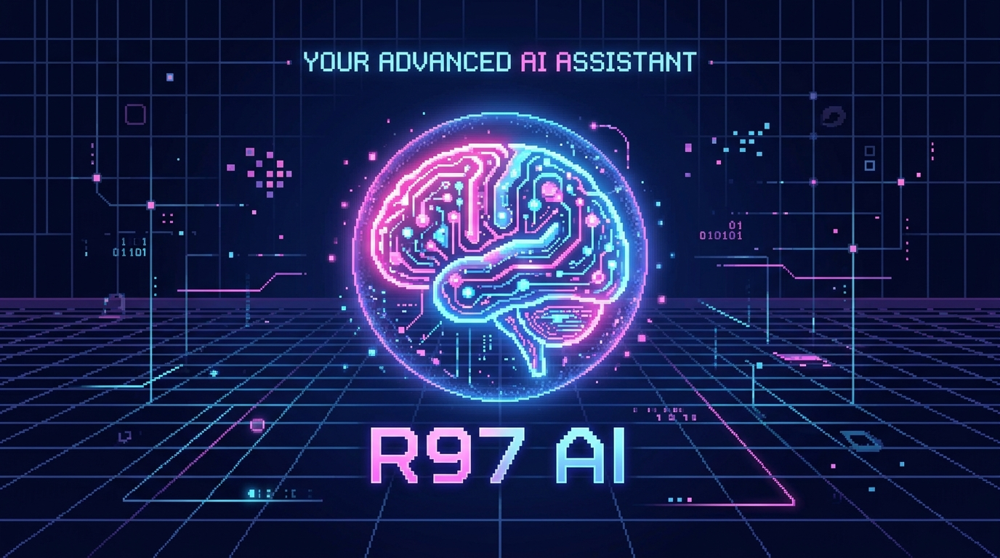
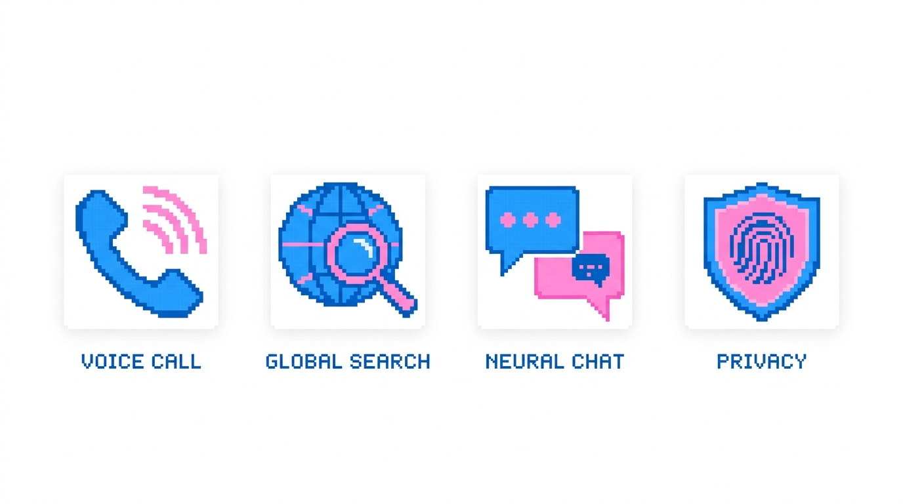

# R97 AI Assistant




**R97 AI** is a premium, client-side intelligence platform designed by **Rehan Ahmad**. It executes purely in the browser environment, connecting directly to NVIDIA's Llama 3.1 inference engine for complex reasoning and deep context resolution.

---

## ⚡ Core Capabilities



### 🧠 Single-Engine Intelligence
- **Deep Reasoning**: Powered by **NVIDIA NIM (Meta Llama 3.1)** for complex problem solving and detailed text responses directly through client-side requests.

### 🌐 Global Web Intelligence
- **Client-Side Storage**: Fully local history and chat states stored safely in `localStorage`. 

### 🗣️ Linguistic Mirroring
- **Native Tongues**: Advanced support for English, Hindi, and **Hinglish**.
- **Style Sync**: The AI automatically adopts the language, tone, and slang of the user for a truly native feel.
- **In-Browser TTS**: Pure client-side Web Speech API Text-to-Speech synthesis for natural voice readout without backend computation.

### 🛡️ Privacy & Logic
- **Smart Formatting**: Automatically filters noise (URLs, code blocks) during voice synthesis for a cleaner experience.
- **Security**: Built-in 100% Client-Side architecture guarantees no permanent storage outside the native environment.

---

## 🛠️ Architecture

- **Frontend**: React 18, Vite, Tailwind CSS, Framer Motion.
- **Backend / Deployment**: Removed. Now purely a Serverless Client-Side Application (SPA).
- **Models**: NVIDIA Llama 3.1 NIM directly queried via client fetch.
- **Styling**: Cyber-Pixel aesthetic with custom-tuned HUD elements.

---

## 👨‍💻 Developer

**R97 AI** is the signature project of **Rehan Ahmad**.
- **GitHub**: [Ft976](https://github.com/Ft976)
- **LinkedIn**: [Rehan Ahmad](https://www.linkedin.com/in/rehan-ahmad-863386382?utm_source=share_via&utm_content=profile&utm_medium=member_android)

---

## ⚖️ Legal & Documentation

For detailed information on the usage, privacy, and development of R97 AI, please refer to:

- **[License](./LICENSE)** - MIT License information.
- **[Privacy Policy](./PRIVACY.md)** - How we handle your data.
- **[Terms of Service](./TERMS.md)** - Guidelines for usage and AI behavior.
- **[Contributing](./CONTRIBUTING.md)** - How to help improve the project.
- **[Security](./SECURITY.md)** - Reporting vulnerabilities.

---

## 🚀 Deployment

Since the entire backend is removed, this runs entirely in the browser. You MUST configure the following Client-Side Environment variable:
```env
NVIDIA_API_KEY=your_key_here
```

⚠️ **Warning**: Using API keys on the client-side exposes them to anyone who inspects the network requests. This configuration is for personal use or strict secure domains. Gemini API is removed natively because secret keys cannot be securely hosted on frontends.

Copyright © 2026 Rehan Ahmad. All Rights Reserved.

